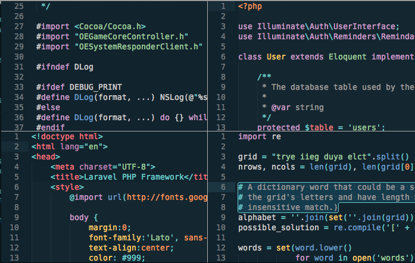

# Oceanic
Oceanic is a theme/color scheme for TextMate/Sublime featuring light-on-dark ocean-inspired colors. There are two variants:

- [Regular](#regular)
- [Eighties (Beta)](#eighties)

## Regular
The original oceanic theme was derrived from [Erebus](https://github.com/Anomareh/Erebus.tmTheme).  It is a little more subdued in tone than the eighties alternate.

### Preview

## Eighties (beta)
This is a fusion of oceanic and [Tomorrow night - Eighties](https://github.com/chriskempson/tomorrow-theme). A much brighter, more electric ocean. Currently labeled beta because I haven't used it long enough to ensure I'm satisfied. Namely, I think there is some room for improvement for CSS and JSON that are needed.  Also, I'm undecided on whether I'll keep the comment begin/end punctuation bright blue.

### Preview

## Muted
The muted variant previously included has been discontinued because I wasn't happy with its aesthetic and I don't have any interest in fixing it.

Please create an issue or pull request if you feel you can offer some improvement.

Enjoy!